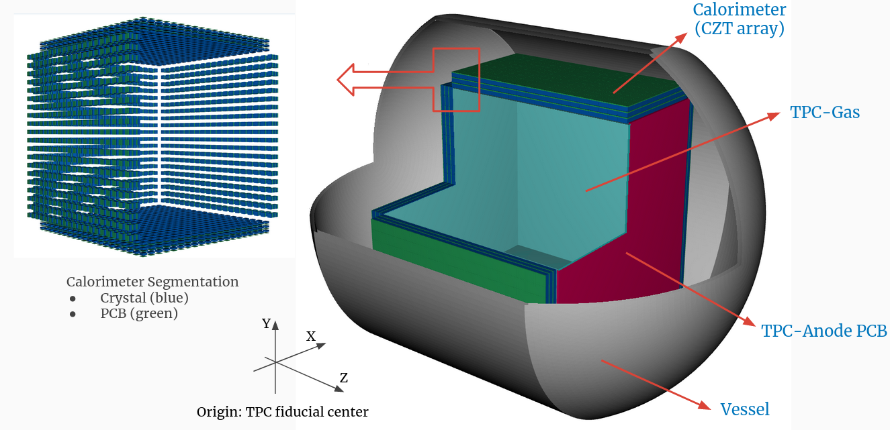

    :Author: yong

.. contents::

1 A Quick Tour
--------------

1.1 Write and run a job
~~~~~~~~~~~~~~~~~~~~~~~

Jobs are steered by a python script called ``job option`` file in Gaudi's jargon.
Users need to write their own job option to customize the job process chain.
The overall picture is simple:

1. ``import`` the services, tools and algorithms needed

2. configure each imported objects by setting their properties

3. append them to the ``AppMgr`` instance

4. finally, run this file with ``k4run your_job_file``

1.1.1 AppMgr (the entrance point)
^^^^^^^^^^^^^^^^^^^^^^^^^^^^^^^^^

1.2 Write a new algorithm
~~~~~~~~~~~~~~~~~~~~~~~~~

Specify following:

1.2.1 Configuration
^^^^^^^^^^^^^^^^^^^

- Gaudi\:\:Property

1.2.2 Event Data access
^^^^^^^^^^^^^^^^^^^^^^^

- Gaudi\:\:DataHandle

1.2.2.1 input
:::::::::::::

1.2.2.2 Output
::::::::::::::

1.2.3 Service access
^^^^^^^^^^^^^^^^^^^^

- Gaudi\:\:ServiceHandle

1.2.4 Processing
^^^^^^^^^^^^^^^^

- initialize()

- execute()

- finalize()

1.3 What is saved in ROOT file
~~~~~~~~~~~~~~~~~~~~~~~~~~~~~~

``EDM4hep`` collections are serialized into ROOT file in flattened structure by ``PodioDataSvc``.
When they are read back, the ``PodioDataSvc`` will assemble these flat pieces back as a usable ``EDM4hep`` collection.

Knowing these flat pieces may be helpful if using third-party tools for quick analysis.
Besides, there are other metadata objects saved alongside the collection components.

#+name tbl:root\_format

.. table::

    +---------------+----------------------------------------------------+-------------------------------------------+------------------------------------------------------------+----------------------------------------+
    | tree name     | branch                                             | type                                      | description                                                | entry number                           |
    +===============+====================================================+===========================================+============================================================+========================================+
    | events        | coll\_name (specified by user, e.g. ``MyHits``)    | ``vector<HitData>``                       | POD part of event data model class (here it's ``HitData``) | event-based                            |
    +---------------+----------------------------------------------------+-------------------------------------------+------------------------------------------------------------+----------------------------------------+
    | \             | reference member of coll\_name (e.g. ``MyHits#0``) | ``vector<ObjectID>``                      | references to other edm41ep collections                    | \                                      |
    +---------------+----------------------------------------------------+-------------------------------------------+------------------------------------------------------------+----------------------------------------+
    | \             | vector member of coll\_name (e.g. ``MyHits_0``)    | ``vector<VecMemType>``                    | vector member of arbitrary type                            | \                                      |
    +---------------+----------------------------------------------------+-------------------------------------------+------------------------------------------------------------+----------------------------------------+
    | metadata      | ``CollectionIDs``                                  | ``podio::CollectionIDTable``              | mapping between ``coll_name`` and collection id            | single entry                           |
    +---------------+----------------------------------------------------+-------------------------------------------+------------------------------------------------------------+----------------------------------------+
    | \             | ``PodioVersion``                                   | ``struct {uint16_t major, minor, patch}`` | PODIO version used                                         | \                                      |
    +---------------+----------------------------------------------------+-------------------------------------------+------------------------------------------------------------+----------------------------------------+
    | \             | ``CollectionTypeInfo``                             | ``vector<tuple<int, string, bool>>``      | info of saved collections: collid, type, isSubsetColl      | \                                      |
    +---------------+----------------------------------------------------+-------------------------------------------+------------------------------------------------------------+----------------------------------------+
    | \             | ``gaudiConfigOptions``                             | ``string``                                | Gaudi job option generating this ROOT file                 | \                                      |
    +---------------+----------------------------------------------------+-------------------------------------------+------------------------------------------------------------+----------------------------------------+
    | \             | ``key4hepStack``                                   | ``string``                                | version of key4stack used if plausible, otherwise empty    | \                                      |
    +---------------+----------------------------------------------------+-------------------------------------------+------------------------------------------------------------+----------------------------------------+
    | evt\_metadata | ``evtMD``                                          | ``podio::GenericParameters``              | event metadata                                             | event-based                            |
    +---------------+----------------------------------------------------+-------------------------------------------+------------------------------------------------------------+----------------------------------------+
    | col\_metadata | ``colMD``                                          | ``map<int,podio::GenericParameters>``     | metadata about edm4hep collections                         | single entry, indexed by collection id |
    +---------------+----------------------------------------------------+-------------------------------------------+------------------------------------------------------------+----------------------------------------+
    | run\_metadata | ``runMD``                                          | ``map<int,podio::GenericParameters>``     | run metadata                                               | single entry, indexed by run id        |
    +---------------+----------------------------------------------------+-------------------------------------------+------------------------------------------------------------+----------------------------------------+

**NOTE:**
the data objects stored are based on current implementation of ``k4FWCore``, which in turn built on top of ``PODIO::EventStore``.
There is a plan to replace ``EventStore`` in the near future, thus forcing ``k4FWCore`` upgrading.
So, the current format may change with the upstream ``k4FWCore``'s upgrade in the future.

2 Gaudi Basics
--------------

2.0.1 Overview
^^^^^^^^^^^^^^

2.0.1.1 Key Concepts
::::::::::::::::::::

.. image:: gaudi_components.png

from `EIC Software Infrastructure Review <https://indico.bnl.gov/event/15644/contributions/65452/attachments/41840/70083/2022.06.29-Experience%20with%20Gaudi-2.pdf>`_

2.0.1.2 Algorithm, Service & Tool
:::::::::::::::::::::::::::::::::

2.0.2 Transient Event Store
^^^^^^^^^^^^^^^^^^^^^^^^^^^

2.0.3 Services
^^^^^^^^^^^^^^

2.0.4 Component-based programming
^^^^^^^^^^^^^^^^^^^^^^^^^^^^^^^^^

2.1 How to use
~~~~~~~~~~~~~~

2.2 General Service Access
~~~~~~~~~~~~~~~~~~~~~~~~~~

Gaudi provides two API for accessing a service:

SmartIF
    general-purpose, low-level, bare-bone

ServiceHandle
    better control on Gaudi usage protocols such as

    - auto create/fetch the underlying service (lazily)

    - data race protection

    - metadata management: typeinfo, python, printing

    - exception handling

The usage is similar and both are:

- Resource Handle in general sense

- smart pointers with reference counting idiom

- easy to use and can be mixed (better following one)

Recommendation: use ServiceHandle unless there is a reason

2.2.1 Method1
^^^^^^^^^^^^^

.. code:: c++

    // declare a member in class definition
    ServiceHandle<ITargetSvc> m_svc;

    // intialize in constructor: (className, parentName)
    // actual acquisition of the service happens lazily in the check step
    MyClass::MyClass(const std::string &aName, ISvcLocator *aSvcLoc)
    : GaudiAlgorithm(aName, aSvcLoc),
      m_svc("SvcType", aName) {}

    // check validity in initialize()
    if (!m_svc) {
      error() << "some error message" << endmsg;
      return StatusCode::FAILURE;
    }

    // ... use m_svc as a pointer

.. image:: ServiceHandle.png

2.2.2 Method2
^^^^^^^^^^^^^

.. code:: c++

    // declare a member in class definition
    SmartIF<ITargetSvc> m_svc;

    // create/fetch the service
    // and check validity in initialize()
    m_svc = service("SvcType");
    if (!m_svc) {
      error() << "some error message" << endmsg;
      return StatusCode::FAILURE;
     }

    // ... use m_svc as a pointer

    /* or, access the service temporarily in GaudiAlgorithm */
    auto m_svc = svc<ITargetSvc>(name, create_if_noexist);

SmartIF has no inheritance.

2.3 Default Service Access
~~~~~~~~~~~~~~~~~~~~~~~~~~

Some services are predefined and used as the default service implementation if user does not override.
These services are immediately available without user configuration.
Dedicated member methods are provided in ``Gaudi::Algorithm`` to access these services conveniently:

.. code:: c++

    SmartIF<IAlgExecStateSvc>& Algorithm::algExecStateSvc() const { return get_svc_( m_aess, "AlgExecStateSvc" ); }
    SmartIF<IAuditorSvc>&      Algorithm::auditorSvc() const { return get_svc_( m_pAuditorSvc, "AuditorSvc" ); }
    SmartIF<IChronoStatSvc>&   Algorithm::chronoSvc() const { return get_svc_( m_CSS, "ChronoStatSvc" ); }
    SmartIF<IDataProviderSvc>& Algorithm::detSvc() const { return get_svc_( m_DDS, "DetectorDataSvc" ); }
    SmartIF<IConversionSvc>&   Algorithm::detCnvSvc() const { return get_svc_( m_DCS, "DetectorPersistencySvc" ); }
    SmartIF<IDataProviderSvc>& Algorithm::eventSvc() const { return get_svc_( m_EDS, "EventDataSvc" ); }
    SmartIF<IConversionSvc>&   Algorithm::eventCnvSvc() const { return get_svc_( m_ECS, "EventPersistencySvc" ); }
    SmartIF<IHistogramSvc>&    Algorithm::histoSvc() const { return get_svc_( m_HDS, "HistogramDataSvc" ); }
    SmartIF<INTupleSvc>&       Algorithm::ntupleSvc() const { return get_svc_( m_NTS, "NTupleSvc" ); }
    SmartIF<IRndmGenSvc>&      Algorithm::randSvc() const { return get_svc_( m_RGS, "RndmGenSvc" ); }
    SmartIF<IToolSvc>&         Algorithm::toolSvc() const { return get_svc_( m_ptoolSvc, "ToolSvc" ); }
    SmartIF<IExceptionSvc>&    Algorithm::exceptionSvc() const { return get_svc_( m_EXS, "ExceptionSvc" ); }
    SmartIF<IAlgContextSvc>&   Algorithm::contextSvc() const { return get_svc_( m_contextSvc, "AlgContextSvc" ); }
    SmartIF<ITimelineSvc>&     Algorithm::timelineSvc() const { return get_svc_( m_timelineSvc, "TimelineSvc" ); }
    SmartIF<IHiveWhiteBoard>&  Algorithm::whiteboard() const { return get_svc_( m_WB, "EventDataSvc" ); }

2.4 Data Access
~~~~~~~~~~~~~~~

2.4.1 Data Access Checklist
^^^^^^^^^^^^^^^^^^^^^^^^^^^

· Do not delete objects that you have registered.
· Do not delete objects that are contained within an object that you have registered.
· Do not register local objects, i.e. objects NOT created with the new operator.
· Do not delete objects which you got from the store via findObject() or retrieveObject().
· Do delete objects which you create on the heap, i.e. by a call to new, and which you do not register into
a store.

2.4.2 Object Key
^^^^^^^^^^^^^^^^

- Default RootName: '/Event'

- PodioInput put collections under: '/Event', it's hardcoded

- RootNode is special

Write Mode: corret name/Path:

.. table::

    +-----------+----------------+-----------+
    | name/Path | internal       | ROOT file |
    +-----------+----------------+-----------+
    | XXX/YYY   | /Event/XXX/YYY | YYY       |
    +-----------+----------------+-----------+
    | /XXX/YYY  | /XXX/YYY       | YYY       |
    +-----------+----------------+-----------+
    | /XXX      | invalid        | \         |
    +-----------+----------------+-----------+

READ Mode: corret name/Path:

.. table::

    +-----------+----------------+-----------+
    | name/Path | internal       | ROOT file |
    +-----------+----------------+-----------+
    | XXX       | /Event/XXX     | XXX       |
    +-----------+----------------+-----------+
    | XXX/YYY   | /Event/XXX/YYY | invalid   |
    +-----------+----------------+-----------+
    | /XXX/YYY  | /Event/YYY     | YYY       |
    +-----------+----------------+-----------+
    | /XXX      | invalid        | \         |
    +-----------+----------------+-----------+

3 Event Data Model
------------------

3.1 Extension of EDM4hep
~~~~~~~~~~~~~~~~~~~~~~~~

- TPC may need special data model not provided by edm4hep

- Possible to define new data class reusing edm4hep classes

- Proposed by EIC community and `EDM4eic <https://github.com/eic/EDM4eic>`_ is a nice reference

.. image:: edm4hep_extension.png

3.2 A Summary of PODIO/EDM4hep
~~~~~~~~~~~~~~~~~~~~~~~~~~~~~~

.. image:: podio_edm4hep_summary.png

- `EIC Software Infrastructure Review: Data Model <https://indico.bnl.gov/event/16676/contributions/66942/attachments/42858/71974/Slides%20-%20Data%20Model.pdf>`_

- some articles by M. Frank

- Podio official doc

3.3 Future development
~~~~~~~~~~~~~~~~~~~~~~

- Current ``k4FWCore`` is limited, no MT support.

- Major updates waiting for podio\:\:Frame

- To be updated to Gaudi\:\:Functional

- Multi-threaded Event Data Service

4 Geometry model
----------------

A parameterized geometry model is available for simulation.

4.1 Time Projection Chamber (TPC)
~~~~~~~~~~~~~~~~~~~~~~~~~~~~~~~~~

- Drift distance based on Helper surface

- Readout segmentation based on Sensitive surface

  - Readout pcb is forced to attach to a Sensitive surface

  - Drift anode surface by default is Helper, but can be changed to Sensitive (in xml)
    if no readout pcb defined

- Multi readout PCB for pixel segmentation is supported

- Only single readout PCB allowed for strip segmentation

.. table:: Parameters of TPC geometry
    :name: tbl:geom_tpc_param

    +------+---------+---------+
    | name | meaning | default |
    +------+---------+---------+
    | \    | \       | \       |
    +------+---------+---------+

4.2 CZT Calorimeter (Calo)
~~~~~~~~~~~~~~~~~~~~~~~~~~

5 System of Units
-----------------

Packages like ``Geant4``, ``TGeo``, ``DD4hep`` use different system of units.
Units conversion when using these packages together may cause confusion if not a bug in later analysis.

.. table:: Comparison of System of Units in various packages
    :name: tbl:system_of_units

    +--------+--------+--------+---------+--------+--------+
    | unit   | Geant4 | DD4hep | EDM4hep | ROOT   | CLHEP  |
    +========+========+========+=========+========+========+
    | Length | mm     | cm     | mm      | cm     | mm     |
    +--------+--------+--------+---------+--------+--------+
    | Energy | MeV    | GeV    | GeV     | GeV    | MeV    |
    +--------+--------+--------+---------+--------+--------+
    | Time   | ns     | s      | ns      | s      | ns     |
    +--------+--------+--------+---------+--------+--------+
    | Angle  | radian | radian | radian  | degree | radian |
    +--------+--------+--------+---------+--------+--------+

Note:
``DD4hep`` default units are same as ``ROOT``, see definition in ``DD4hep/DDParsers/include/Evaluator/DD4hepUnits.h``.
Units in ``DD4hep`` can be changed to be same as ``Geant4`` when build with ``DD4HEP_USE_GEANT4_UNITS=ON``.
``DD4hep`` also provides a patch of ``TGeo`` to use ``Geant4`` units as well.
This build option is also passed to sub-projects using ``DD4hepConfig.cmake`` (see ReleaseNote ``DD4hep/doc/ReleaseNotes.md:1110``).
By default, this option is off (also in key4hep Spack default).

``Meagat`` software currently follows ``EDM4hep`` convention, using (GeV, mm, ns, radian) as default units.
Header ``k4megat/sim/kernel/include/SimKernel/Units.h`` gives a definition of these units:

.. code:: c++

    using namespace megat;

    // default length unit
    float d = 5 * edmdefault::length;

    // default energy unit
    double e = 100. * edmdefault::energy;

    // default time unit
     double t = 2. * edmdefault::time;

This also applies to data read from ``EDM4hep`` data from disk.

The best practice is always explicitly specifying the unit when using a value, as shown above.
This includes the numerical ``Gaudi::Property`` for configuring an algorithm like:

.. code:: c++

    // in class declaration header
    Gaudi::Property<float> m_wValue{ this, "wvalue", 25, "[eV] Mean activation energy during primary ionization" };

    // in member function: initialize()
    m_wValue        = m_wValue * CLHEP::eV;

Unit conversion may be needed when passing numerical values from one package to another.
Conversion factors between popular packages are defined in ``Units.h`` as well:

.. code:: c++

    using namespace megat;

    // EDM <-> Geant4
    auto* g4Particle = new G4PrimaryParticle( mcp.getPDG(), mom.x * edm2g4::energy,
                                              mom.y * edm2g4::energy, mom.z * edm2g4::energy );

    // EDM <-> DD4hep
    // get a position from EDM4hep root file
    auto gpos    = hit.getPosition(); 
    // use DD4hep's utility to do some calculation
    auto drift_d = anode_surf->distance( edm2dd::length * gpos ) * dd2edm::length;

6 Random number service
-----------------------

Basic picture:

- **random engine** generates random number in a flat distribution in (0, 1)

  - it's the most basic stuff, thus called 'engine'

- **random generator** uses a **random engine** to produce all types of probability distribution

- **random service** provides an interface for end users configuring and using the engine or the generator

6.1 RndmGenSv
~~~~~~~~~~~~~

This is the default service for random number generation in ``Gaudi``.
It is created automatically (without user configuration), in a lazy way, i.e. created when used.
It's based on ``CLHEP``'s random number implementation.

6.1.1 Use in Algorithm development
^^^^^^^^^^^^^^^^^^^^^^^^^^^^^^^^^^

Most of the time, user only needs to know how to use the **random generator** when developing his/her algorithm.

.. code:: c++

    // random service is directly available by member function:
    randSvc();

    // 1. by generator interface
    auto gen = randSvc()->generator( Rndm::Gauss( 0.5, 0.2 ) );
    auto value = gen->shoot();
    // or array
    gen->shootArray(vector_values， number);

    // 2. by number interface (a wrapper of generator)
    Rndm::Numbers exponential( randSvc(), Rndm::Exponential( 0.2 ) );
    hist->Fill(exponential());

    // or initialize it later
    Rndm::Numbers exponential;
    exponential.initialize( randSvc(), Rndm::Exponential( 0.2 ) );

6.1.2 Configuration in Job option
^^^^^^^^^^^^^^^^^^^^^^^^^^^^^^^^^

The default engine is ``HepRndm::Engine<CLHEP::Ranlux64Engine>`` with fixed seed number '1234567'.
Engine can be customized in job option.

.. code:: python

    # 1. Just change the engine type
    from Configurables import RndmGenSvc

    rdmSvc = RndmGenSvc("RndmGenSvc") # default name for auto-recognizing
    rdmSvc.Engine = "HepRndm::Engine<CLHEP::HepJamesRandom>"

    AppMgr.ExtSvc +=[rdmSvc]

    # 2. Also customized the engine params
    from Configurables import HepRndm__Engine_CLHEP__HepJamesRandom_

    rdmEngine = HepRndm__Engine_CLHEP__HepJamesRandom_("RndmGenSvc.Engine") # default name for auto-recognizing
    rdmEngine.SetSingleton = True
    rdmEngine.Seeds = [5685]

    AppMgr.ExtSvc +=[rdmEngine]

    # optional: pass the name to rdmSvc for correct messaging
    rdmSvc.Engine = rdmEngine.name()

6.1.3 List of engines
^^^^^^^^^^^^^^^^^^^^^

.. code:: c++

    // /home/yong/src/physics/key4hep/Gaudi/GaudiSvc/src/RndmGenSvc/HepRndmEngines.cpp
      HepRndm::Engine<DualRand>
      HepRndm::Engine<TripleRand>
      HepRndm::Engine<DRand48Engine>
      HepRndm::Engine<Hurd160Engine>
      HepRndm::Engine<Hurd288Engine>
      HepRndm::Engine<HepJamesRandom>
      HepRndm::Engine<MTwistEngine>
      HepRndm::Engine<RanecuEngine>
      HepRndm::Engine<Ranlux64Engine>
      HepRndm::Engine<RanluxEngine>
      HepRndm::Engine<RanshiEngine>

6.1.4 List of generators
^^^^^^^^^^^^^^^^^^^^^^^^

.. code:: c++

    // /home/yong/src/physics/key4hep/Gaudi/GaudiKernel/include/GaudiKernel/RndmGenerators.h
    Rndm::Gauss;
    Rndm::Exponential;
    Rndm::Chi2;
    Rndm::BreitWigner;
    Rndm::Landau;
    Rndm::BreitWignerCutOff;
    Rndm::StudentT;
    Rndm::Gamma;
    Rndm::Poisson;
    Rndm::Binomial;
    Rndm::Flat;
    Rndm::Bit;
    Rndm::DefinedPdf;
    Rndm::GaussianTail;

6.2 Class diagram
~~~~~~~~~~~~~~~~~

It's possible to implement a new random number service.
This diagram shows the implementation details.

.. image:: rndm_class.png

7 Resources
-----------

7.1 Reference projects
~~~~~~~~~~~~~~~~~~~~~~

These projects can be used as an example of using ``Key4hep`` components
and in general of how to build a NHEP experiment software.

7.1.1 EIC
^^^^^^^^^

**EIC** is building a complete software stack based on ``key4hep`` components.
This a gold mine, personal recommendation.
Actively developed with modern C++.
The project members are also contributors to several ``Key4hep`` component package.

`NPDet <https://eicweb.phy.anl.gov/EIC/NPDet.git>`_
    A collection of detector models for EIC, based on DD4hep

`npsim <https://github.com/eic/npsim>`_
    DD4hep plugins for EIC simulation

`EPIC <https://github.com/eic/epic>`_
    Complete detector model of EIC experiment

`EDM4eic <https://github.com/eic/EDM4eic>`_
    event data model based on PODIO and EDM4hep

`Juggler <https://eicweb.phy.anl.gov/EIC/juggler>`_
    EIC software for prototype study. Based on Gaudi, still actively developed.

EICrecon
    EIC official software based on JANA2

    - algorithms migrated from Juggler to JANA2 in process

    - also depends on NPDET and EDM4eic

7.1.2 FCC
^^^^^^^^^

- The official demo project recommended by ``key4hep``.

  - The community develops ``k4FWCore`` and ``k4SimGeant4``.

- Its code bases are kept in pace with latest development of ``key4hep``.

- CEPCSW is a descendant

7.1.3 OpenDetector
^^^^^^^^^^^^^^^^^^

A experiment neutral detector aims to be used as a testbed for ``ACTS``.
It's built upon ``DD4hep`` and is kept in pace with the two packages latest development.

7.2 About Gaudi
~~~~~~~~~~~~~~~

The `official documentation <https://gaudi-framework.readthedocs.io/en/latest/>`_ is a combination of legacy compatibility and latest development.
But it provides a very nice overview of the architecture design and key building blocks.
Not needed for end user, recommend for average developer, a must read for software builder/maintainer.

7.3 Others
~~~~~~~~~~

7.3.1 Software build
^^^^^^^^^^^^^^^^^^^^

- `modern cmake <https://cliutils.gitlab.io/modern-cmake/chapters/install/exporting.html>`_

- git

7.3.2 Modern C++
^^^^^^^^^^^^^^^^

- `Cheatsheat of using modern C++ <https://github.com/BartVandewoestyne/Effective-Modern-Cpp>`_

  - 中文学习笔记以及示例代码，作者其它的笔记也值得一读

- `现代C++教程：高速上手C++11/14/17/20 <https://changkun.de/modern-cpp/>`_

- `C++ Rvalue References Explained <http://thbecker.net/articles/rvalue_references/section_01.html>`_

  - what, how, why of move and perfect forward

  - `more examples <https://www.artima.com/articles/a-brief-introduction-to-rvalue-references>`_

- `Cpp Guideline <http://isocpp.github.io/CppCoreGuidelines/CppCoreGuidelines>`_

  - all the best practices of using modern C++

  - Maybe the ultimate source of reference?

- `More C++ Idioms <https://en.wikibooks.org/wiki/More_C%2B%2B_Idioms>`_
