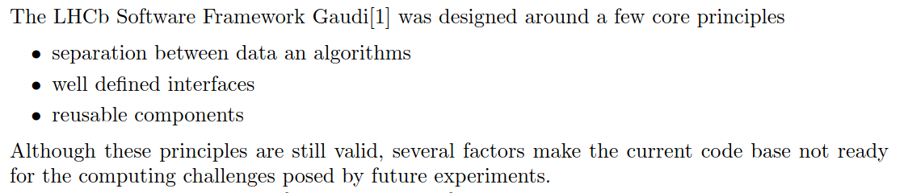
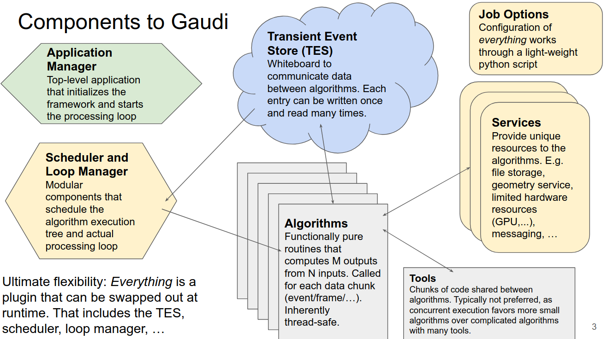
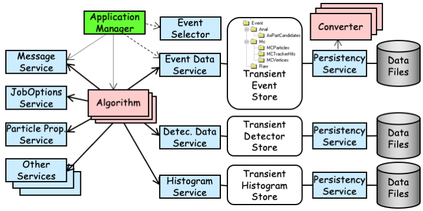
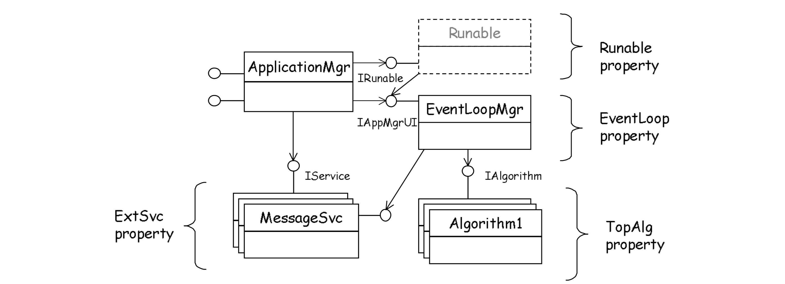
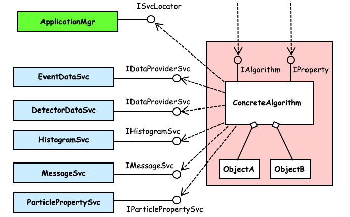
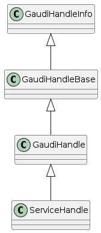
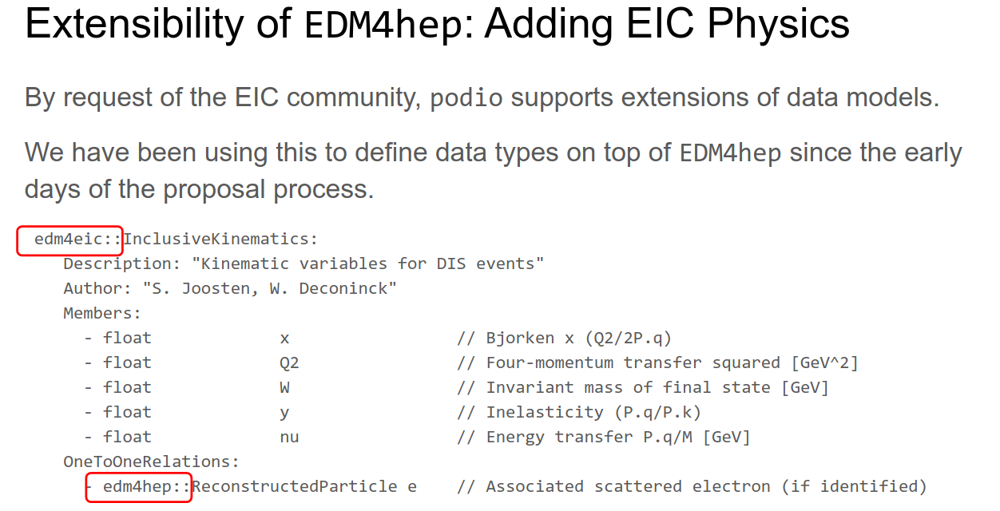
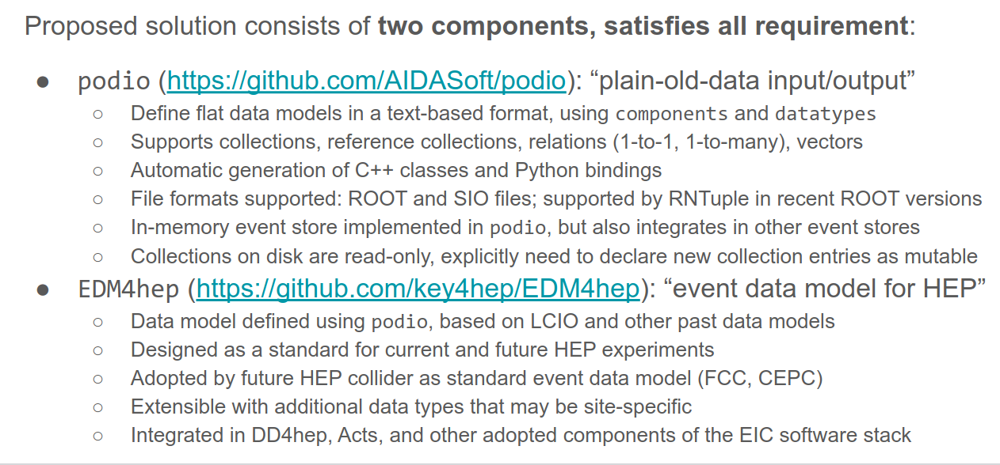

    :Author: yong

.. contents::

1 A Quick Tour
--------------

1. job option

   - configure the properties of svc/tool/alg

   - append the svc/tool/alg to AppMgr

2. component template

3. build system

1.1 Overview
~~~~~~~~~~~~

Gaudi is a mature software project with continuous development ~20 years.
The core team has the plan to 'modernize' its codebase due to latest progress both in
hardware and software technology (most notably new C++ language features).
However, the architecture is still well-designed even from contemporary point of view.
Thus, it has been chosen as the recommended event processing framework of key4hep project.

For compatibility reason, Gaudi codebase causes confusion at first glance, i.e. different
implementation of similar functions/interfaces/abstractions.
Effort is needed to figure out the 'legacy' code and the 'modern' code.

I will try the best to filter out the best practice of using Gaudi, in the sense that the feature will
not be deprecated in a long term of view.
But I'm learning it as well.

1.2 AppMgr (the entrance)
~~~~~~~~~~~~~~~~~~~~~~~~~

Options configuration (the steering parameters)
~~~~~~~~~~~~~~~~~~~~~~~~~~~~~~~~~~~~~~~~~~~~~~~

2 Gaudi Basics
--------------

2.1 Overview
~~~~~~~~~~~~

2.1.1 Key Concepts
^^^^^^^^^^^^^^^^^^

from `EIC Software Infrastructure Review <https://indico.bnl.gov/event/15644/contributions/65452/attachments/41840/70083/2022.06.29-Experience%20with%20Gaudi-2.pdf>`_

2.1.2 Runtime Object Model
^^^^^^^^^^^^^^^^^^^^^^^^^^

2.1.3 Application Bootstrap
^^^^^^^^^^^^^^^^^^^^^^^^^^^

2.1.4 Algorithm View Point
^^^^^^^^^^^^^^^^^^^^^^^^^^

2.2 Transient Event Store
~~~~~~~~~~~~~~~~~~~~~~~~~

2.2.1 Data Access Checklist
^^^^^^^^^^^^^^^^^^^^^^^^^^^

· Do not delete objects that you have registered.
· Do not delete objects that are contained within an object that you have registered.
· Do not register local objects, i.e. objects NOT created with the new operator.
· Do not delete objects which you got from the store via findObject() or retrieveObject().
· Do delete objects which you create on the heap, i.e. by a call to new, and which you do not register into
a store.

2.3 Component
~~~~~~~~~~~~~

2.4 Algorithm, Service & Tool
~~~~~~~~~~~~~~~~~~~~~~~~~~~~~

3 Service Access
----------------

Gaudi provides two API for accessing a service:

SmartIF
    general-purpose, low-level, bare-bone

ServiceHandle
    better control on Gaudi usage protocols such as

    - auto create/fetch the underlying service (lazily)

    - data race protection

    - metadata management: typeinfo, python, printing

    - exception handling

The usage is similar and both are:

- Resource Handle in general sense

- smart pointers with reference counting idiom

- easy to use and can be mixed (better following one)

Recommendation: use ServiceHandle unless there is a reason

3.1 Method1
~~~~~~~~~~~

.. code:: c++

    // declare a member in class definition
    ServiceHandle<ITargetSvc> m_svc;

    // intialize in constructor: (className, parentName)
    // actual acquisition of the service happens lazily in the check step
    MyClass::MyClass(const std::string &aName, ISvcLocator *aSvcLoc)
    : GaudiAlgorithm(aName, aSvcLoc),
      m_svc("SvcType", aName) {}

    // check validity in initialize()
    if (!m_svc) {
      error() << "some error message" << endmsg;
      return StatusCode::FAILURE;
    }

    // ... use m_svc as a pointer

3.2 Method2
~~~~~~~~~~~

.. code:: c++

    // declare a member in class definition
    SmartIF<ITargetSvc> m_svc;

    // create/fetch the service
    // and check validity in initialize()
    m_svc = service("SvcType");
    if (!m_svc) {
      error() << "some error message" << endmsg;
      return StatusCode::FAILURE;
     }

    // ... use m_svc as a pointer

SmartIF has no inheritance.

4 Data Access
-------------

4.1 Object Key
~~~~~~~~~~~~~~

- Default RootName: '/Event'

- PodioInput put collections under: '/Event', it's hardcoded

- RootNode is special

Write Mode: corret name/Path:

.. table::

    +-----------+----------------+-----------+
    | name/Path | internal       | ROOT file |
    +-----------+----------------+-----------+
    | XXX/YYY   | /Event/XXX/YYY | YYY       |
    +-----------+----------------+-----------+
    | /XXX/YYY  | /XXX/YYY       | YYY       |
    +-----------+----------------+-----------+
    | /XXX      | invalid        | \         |
    +-----------+----------------+-----------+

READ Mode: corret name/Path:

.. table::

    +-----------+----------------+-----------+
    | name/Path | internal       | ROOT file |
    +-----------+----------------+-----------+
    | XXX       | /Event/XXX     | XXX       |
    +-----------+----------------+-----------+
    | XXX/YYY   | /Event/XXX/YYY | invalid   |
    +-----------+----------------+-----------+
    | /XXX/YYY  | /Event/YYY     | YYY       |
    +-----------+----------------+-----------+
    | /XXX      | invalid        | \         |
    +-----------+----------------+-----------+

5 Event Data Model
------------------

5.1 Extension of EDM4hep
~~~~~~~~~~~~~~~~~~~~~~~~

- TPC may need special data model not provided by edm4hep

- Possible to define new data class reusing edm4hep classes

- Proposed by EIC community and `EDM4eic <https://github.com/eic/EDM4eic>`_ is a nice reference

5.2 What's in ROOT file
~~~~~~~~~~~~~~~~~~~~~~~

5.3 A Summary of PODIO/EDM4hep
~~~~~~~~~~~~~~~~~~~~~~~~~~~~~~

- `EIC Software Infrastructure Review: Data Model <https://indico.bnl.gov/event/16676/contributions/66942/attachments/42858/71974/Slides%20-%20Data%20Model.pdf>`_

- some articles by M. Frank

- Podio official doc

5.4 Future development
~~~~~~~~~~~~~~~~~~~~~~

- Current ``k4FWCore`` is limited, no MT support.

- Major updates waiting for podio\:\:Frame

- To be updated to Gaudi\:\:Functional

- Multi-threaded Event Data Service

6 Resources
-----------

6.1 Reference projects
~~~~~~~~~~~~~~~~~~~~~~

These projects can be used as an example of using ``Key4hep`` components
and in general of how to build a NHEP experiment software.

6.1.1 EIC
^^^^^^^^^

This a gold mine, personal recommendation. Actively developed with modern C++.
The project members are also contributors to several ``Key4hep`` component package.

- NPDet

- joggler

6.1.2 FCC
^^^^^^^^^

The official demo project recommended by ``key4hep``.
The community develops ``k4FWCore`` and ``k4SimGeant4``.
Its code bases are kept in pace with latest development of ``key4hep``.

6.1.3 OpenDetector
^^^^^^^^^^^^^^^^^^

A experiment neutral detector aims to be used as a testbed for ``ACTS``.
It's built upon ``DD4hep`` and is kept in pace with the two packages latest development.

6.2 About Gaudi
~~~~~~~~~~~~~~~

The `official documentation <https://gaudi-framework.readthedocs.io/en/latest/>`_ is a combination of legacy compatibility and latest development.
But it provides a very nice overview of the architecture design and key building blocks.
Not needed for end user, recommend for average developer, a must read for software builder/maintainer.

LHCb provides `some tutorial for Gaudi & Modern C++ <https://lhcb.github.io/DevelopKit/>`_

6.3 Others
~~~~~~~~~~

6.3.1 Software build
^^^^^^^^^^^^^^^^^^^^

- `modern cmake <https://cliutils.gitlab.io/modern-cmake/chapters/install/exporting.html>`_

- git

6.3.2 presentation
^^^^^^^^^^^^^^^^^^

All based on modern Web technology (HTML5+CSS+JavaScript)

Markdown-based:

- `slidev <https://sli.dev/>`_

Org-mode based:

- `org-re-reveal <https://gitlab.com/oer/org-re-reveal>`_

- `ox-spectacle <https://github.com/lorniu/ox-spectacle>`_
