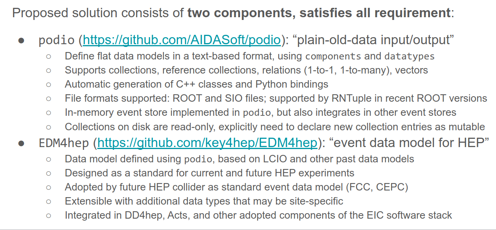
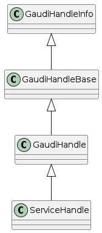
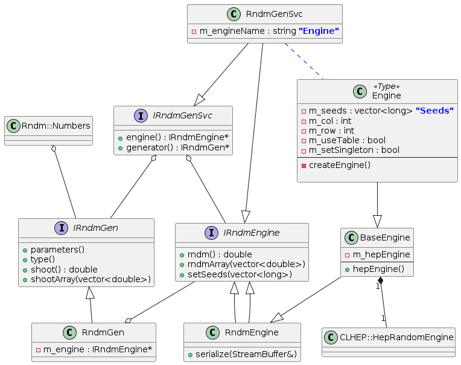

    :Author: yong

.. contents::


1 A Quick Tour
--------------

1.1 Overview
~~~~~~~~~~~~

**k4megat** follows the latest HENP software development trend.

Key components (aka `Key4hep <https://key4hep.github.io/key4hep-doc/>`_ software stack) are:

Event processing framework
    `Gaudi <https://gitlab.cern.ch/gaudi/>`_

Event data format
    `EMD4hep <https://github.com/key4hep/EDM4hep>`_

    Interface to Gaudi's event data store
        `k4FWCore <https://github.com/key4hep/k4FWCore>`_

Detector geometry management
    `DD4hep <https://github.com/AIDASoft/DD4hep>`_

Simulation interface (adapated to Gaudi's algorithm pattern)
    migrated from `k4SimGeant4 <https://github.com/HEP-FCC/k4SimGeant4>`_

1.2 Write and run a job
~~~~~~~~~~~~~~~~~~~~~~~

Jobs are steered by a python script called ``job option`` file in Gaudi's jargon.
Users need to write their own job option to customize the job process chain.

The job option file contains:

1. ``import`` the services, tools and algorithms needed

2. configure each imported objects by setting their properties

3. append them to the ``AppMgr`` instance

To run the job:

.. code:: shell

    k4run <JOB_FILE>

1.3 Write a new algorithm
~~~~~~~~~~~~~~~~~~~~~~~~~

Writing a Gaudi algorithm for a specific task is the most common development.
The development can be grouped as follows:

Property specification
    parameters passed in in job option files to control the
    behavior of the algorithm

Event data access
    event data input/output, or interfacing with event data store

Service access
    e.g. detector geometry, random number etc.

Processing
    the real computing work of the algorithm, which are formalized as three
    callback functions: ``initialize(), execute(), finalize()``

Component declaration
    create the algorithm as a Gaudi plugin component, so that it
    can be loaded automatically.

1.3.1 Configuration (Gaudi\:\:Property)
^^^^^^^^^^^^^^^^^^^^^^^^^^^^^^^^^^^^^^^

Define the property in the algorithm's class definition:

.. code:: c++

    // in header: declare a property data member
    // arguments: {this, NAME, DEFAULT_VALUE, COMMENT}
    Gaudi::Property<double> m_sigmaE{ this, "energy_sigma", 50,
                                      "[eV] Sigma of the energy distribution of a single channel" };
    Gaudi::Property<double> m_sigmaT{ this, "time_sigma", 100,
                                      "[ps] Sigma of the time distribution of a single channel" };

The property values are specified in job option file as follows:

.. code:: python

    from Configurables import TpcSimpleSmearAlg
    tpcpixelsmeared = TpcSimpleSmearAlg("TpcPixelSmear")
    tpcpixelsmeared.energy_sigma = 10 # eV
    tpcpixelsmeared.time_sigma = 100 # ps

1.3.2 Event Data access
^^^^^^^^^^^^^^^^^^^^^^^

- Gaudi\:\:DataHandle

1.3.2.1 input
:::::::::::::

1.3.2.2 Output
::::::::::::::

1.3.3 Service access
^^^^^^^^^^^^^^^^^^^^

- Gaudi\:\:ServiceHandle

1.3.4 Processing
^^^^^^^^^^^^^^^^

- initialize()

- execute()

- finalize()

1.3.5 Component declaration
^^^^^^^^^^^^^^^^^^^^^^^^^^^

To be

1.4 Tutorial
~~~~~~~~~~~~

The `mgtut <https://github.com/MegMev/mgtut>`_ repository contains examples of demo algorithms and the associated job options showing how to use and how to
develop Gaudi algorithms.

The repository is also a standalone Gaudi project, which acts as a template for the development of your own algorithms.

2 Event Data Model
------------------

``EDM4hep`` is the underlying event data model, which is defined and generated using `podio <https://github.com/AIDASoft/podio>`_ library which implements an event data
description language, defines template sources for in-memory representation, defines an I/O interface for persistence,
and an example implementation for ROOT file persistence.

It aims to be the standard data model in HENP community.
In this way, not only the development of components in the same experiment software can be decoupled, but also common processing packages can be
developed and shared in the community such as `Acts Common Tracking Software <https://acts.readthedocs.io/en/latest/index.html>`_.
All next-generation collider experiments have adopted ``EDM4hep`` for their pilot simulation studies.

A good summary of ``podio/EDM4hep`` features can be found int `EIC Software Infrastructure Review: Data Model <https://indico.bnl.gov/event/16676/contributions/66942/attachments/42858/71974/Slides%20-%20Data%20Model.pdf>`_.


2.1 What is saved in ROOT file
~~~~~~~~~~~~~~~~~~~~~~~~~~~~~~

``EDM4hep`` classes (more precisely, ``collections``) are serialized to ROOT file into **FLAT structure** by ``PodioDataSvc`` (from ``k4FWCore``).
When they are read back, the ``PodioDataSvc`` will assemble these flat pieces back as a usable ``EDM4hep`` class.

In most cases, users do not need to care about the persistence format when designing algorithms based on Gaudi, since
``Gaudi::DataHandle`` hides these details and gives users an uniform interface.
However, knowing these flat pieces may be helpful if using third-party tools (especially tools from Python ecosystem) for quick analysis.
Besides, there are other metadata objects saved alongside the collection components, which give valuable information from
data management point of view.

#+name tbl:root\_format

.. table::

    +---------------+----------------------------------------------------+-------------------------------------------+------------------------------------------------------------+----------------------------------------+
    | tree name     | branch                                             | type                                      | description                                                | entry number                           |
    +===============+====================================================+===========================================+============================================================+========================================+
    | events        | coll\_name (specified by user, e.g. ``MyHits``)    | ``vector<HitData>``                       | POD part of event data model class (here it's ``HitData``) | event-based                            |
    +---------------+----------------------------------------------------+-------------------------------------------+------------------------------------------------------------+----------------------------------------+
    | \             | reference member of coll\_name (e.g. ``MyHits#0``) | ``vector<ObjectID>``                      | references to other edm41ep collections                    | \                                      |
    +---------------+----------------------------------------------------+-------------------------------------------+------------------------------------------------------------+----------------------------------------+
    | \             | vector member of coll\_name (e.g. ``MyHits_0``)    | ``vector<VecMemType>``                    | vector member of arbitrary type                            | \                                      |
    +---------------+----------------------------------------------------+-------------------------------------------+------------------------------------------------------------+----------------------------------------+
    | metadata      | ``CollectionIDs``                                  | ``podio::CollectionIDTable``              | mapping between ``coll_name`` and collection id            | single entry                           |
    +---------------+----------------------------------------------------+-------------------------------------------+------------------------------------------------------------+----------------------------------------+
    | \             | ``PodioVersion``                                   | ``struct {uint16_t major, minor, patch}`` | PODIO version used                                         | \                                      |
    +---------------+----------------------------------------------------+-------------------------------------------+------------------------------------------------------------+----------------------------------------+
    | \             | ``CollectionTypeInfo``                             | ``vector<tuple<int, string, bool>>``      | info of saved collections: collid, type, isSubsetColl      | \                                      |
    +---------------+----------------------------------------------------+-------------------------------------------+------------------------------------------------------------+----------------------------------------+
    | \             | ``gaudiConfigOptions``                             | ``string``                                | Gaudi job option generating this ROOT file                 | \                                      |
    +---------------+----------------------------------------------------+-------------------------------------------+------------------------------------------------------------+----------------------------------------+
    | \             | ``key4hepStack``                                   | ``string``                                | version of key4stack used if plausible, otherwise empty    | \                                      |
    +---------------+----------------------------------------------------+-------------------------------------------+------------------------------------------------------------+----------------------------------------+
    | evt\_metadata | ``evtMD``                                          | ``podio::GenericParameters``              | event metadata                                             | event-based                            |
    +---------------+----------------------------------------------------+-------------------------------------------+------------------------------------------------------------+----------------------------------------+
    | col\_metadata | ``colMD``                                          | ``map<int,podio::GenericParameters>``     | metadata about edm4hep collections                         | single entry, indexed by collection id |
    +---------------+----------------------------------------------------+-------------------------------------------+------------------------------------------------------------+----------------------------------------+
    | run\_metadata | ``runMD``                                          | ``map<int,podio::GenericParameters>``     | run metadata                                               | single entry, indexed by run id        |
    +---------------+----------------------------------------------------+-------------------------------------------+------------------------------------------------------------+----------------------------------------+

**NOTE:**
the data objects stored are based on current implementation of ``k4FWCore``, which in turn built on top of ``PODIO::EventStore``.
There is a plan to replace ``EventStore`` by ``podio`` developers in the near future, thus forcing ``k4FWCore`` to be upgraded.
So, the current format may change when this upgrade happens.

Example scripts are provided for inspecting metadata trees.

2.2 TODO Future development
~~~~~~~~~~~~~~~~~~~~~~~~~~~

- Current ``k4FWCore`` is limited, no MT support.

  - Multi-threaded Event Data Service

- To be updated to Gaudi\:\:Functional

- Extension of EDM4hep

  - TPC may need special data model not provided by edm4hep

  - Possible to define new data class reusing edm4hep classes

  - Proposed by EIC community and `EDM4eic <https://github.com/eic/EDM4eic>`_ is a nice reference, `see this slide <fig/edm4hep_extension.png>`_

3 Geometry model
----------------

Geometry model description is based on ``DD4hep`` compact XML syntax.
Knowledge of ``DD4hep`` is not needed for end user, recommend for average developer, a must read for software builder/maintainer.

A parameterized geometry model (yet simplified) is available, consisting of:

- CZT calorimetor

- TPC

- Vessel

.. image:: fig/megat_geometry_model.png

3.1 Time Projection Chamber (TPC)
~~~~~~~~~~~~~~~~~~~~~~~~~~~~~~~~~

3.1.1 Implementation details (DD4hep-related)
^^^^^^^^^^^^^^^^^^^^^^^^^^^^^^^^^^^^^^^^^^^^^

- Drift distance based on Helper surface

- Readout segmentation based on Sensitive surface

  - Readout pcb is forced to attach to a Sensitive surface

  - Drift anode surface by default is Helper, but can be changed to Sensitive (in xml)
    if no readout pcb defined

- Multi readout PCB for pixel segmentation is supported

- Only single readout PCB allowed for strip segmentation

.. table:: Parameters of TPC geometry
    :name: tbl:geom_tpc_param

    +------+---------+---------+
    | name | meaning | default |
    +------+---------+---------+
    | \    | \       | \       |
    +------+---------+---------+

3.2 CZT Calorimeter (Calo)
~~~~~~~~~~~~~~~~~~~~~~~~~~

4 System of Units
-----------------

Packages like ``Geant4``, ``ROOT/TGeo``, ``DD4hep`` use different system of units.
Special attention is needed for units conversion, which may cause confusion if not a bug in later analysis.

.. table:: Comparison of System of Units in various packages
    :name: tbl:system_of_units

    +--------+--------+--------+---------+-----------+--------+
    | unit   | Geant4 | DD4hep | EDM4hep | ROOT/TGeo | CLHEP  |
    +========+========+========+=========+===========+========+
    | Length | mm     | cm     | mm      | cm        | mm     |
    +--------+--------+--------+---------+-----------+--------+
    | Energy | MeV    | GeV    | GeV     | GeV       | MeV    |
    +--------+--------+--------+---------+-----------+--------+
    | Time   | ns     | s      | ns      | s         | ns     |
    +--------+--------+--------+---------+-----------+--------+
    | Angle  | radian | radian | radian  | degree    | radian |
    +--------+--------+--------+---------+-----------+--------+

Note:
``DD4hep`` default units are same as ``ROOT``, see definition in ``DD4hep/DDParsers/include/Evaluator/DD4hepUnits.h``.
Units in ``DD4hep`` can be changed to be same as ``Geant4`` when build with ``DD4HEP_USE_GEANT4_UNITS=ON``.
``DD4hep`` also provides a patch of ``TGeo`` to use ``Geant4`` units as well.
This build option is also passed to sub-projects using ``DD4hepConfig.cmake`` (see ReleaseNote ``DD4hep/doc/ReleaseNotes.md:1110``).
By default, this option is off (as well as in key4hep Spack bundle).

``Meagat`` software currently follows ``EDM4hep`` convention, i.e. using (GeV, mm, ns, radian) as default units.
Note: internally, ``CLHEP`` units are used to represent all units and calculate conversion factors between different systems of units
(see ``k4megat/sim/kernel/include/SimKernel/Units.h`` for a list of common conversion factors).

Best practice: always specifying the unit when first getting a raw value outside of ``EDM4hep``.
For example, when initializing a numerical ``Gaudi::Property``:

.. code:: c++

    // in class declaration header
    Gaudi::Property<float> m_wValue{ this, "wvalue", 25, "[eV] Mean activation energy during primary ionization" };

    // in initialize()
    // here, using CLHEP directly for the fine units
    m_wValue        = m_wValue * CLHEP::eV;

    // in execute()
    // here, using deposit energy to calculate number of generated electrons
    int cur_eno = hit.getEDep() * edmdefault::energy / m_wValue;

Another common case is unit conversion when passing numerical values between different packages.
For example, the conversion between ``EDM4hep`` and ``Geant4`` or ``DD4hep``.

.. code:: c++

    using namespace megat;

    // EDM <-> Geant4
    // here, mom is read from a EDM4hep root file
    auto* g4Particle = new G4PrimaryParticle( mcp.getPDG(), mom.x * edm2g4::energy,
                                              mom.y * edm2g4::energy, mom.z * edm2g4::energy );

    // EDM <-> DD4hep
    // here, hit is read from EDM4hep root file
    auto gpos    = hit.getPosition();
    // use DD4hep's utility to do some calculation
    auto drift_d = anode_surf->distance( edm2dd::length * gpos ) * dd2edm::length;

5 Gaudi Internals
-----------------

This section contains technical details of ``Gaudi`` framework, aiming to give some insight about its
internal plumbings.

5.1 Overview
~~~~~~~~~~~~

`Gauid Components Architecture <fig/gaudi_components.png>`_ from `EIC Software Infrastructure Review <https://indico.bnl.gov/event/15644/contributions/65452/attachments/41840/70083/2022.06.29-Experience%20with%20Gaudi-2.pdf>`_.

5.1.1 Algorithm
^^^^^^^^^^^^^^^

5.1.2 Transient Event Store (TES)
^^^^^^^^^^^^^^^^^^^^^^^^^^^^^^^^^

5.1.3 Service
^^^^^^^^^^^^^

5.1.4 Tool
^^^^^^^^^^

5.1.5 Component-based programming
^^^^^^^^^^^^^^^^^^^^^^^^^^^^^^^^^

5.2 Service Access
~~~~~~~~~~~~~~~~~~

5.2.1 General Service Access
^^^^^^^^^^^^^^^^^^^^^^^^^^^^

Gaudi provides two API for accessing a service:

``SmartIF``
    general-purpose, low-level, bare-bone

``ServiceHandle``
    better control on Gaudi usage protocols such as

    - auto create/fetch the underlying service (lazily)

    - data race protection

    - metadata management: typeinfo, python, printing

    - exception handling

The usage is similar and both are:

- Resource Handle in general sense

- smart pointers with reference counting idiom

- easy to use and can be mixed (better following one)

Recommendation: use ServiceHandle unless there is a reason not to.

5.2.1.1 Method 1 (with ``ServiceHandle``)
:::::::::::::::::::::::::::::::::::::::::

.. code:: c++

    // in header file: declare a data member in class definition
    ServiceHandle<ITargetSvc> m_svc;

    // in src file: intialize in constructor: (componentName, parentName)
    // actual acquisition of the service happens lazily in the check step
    MyClass::MyClass(const std::string &aName, ISvcLocator *aSvcLoc)
    : GaudiAlgorithm(aName, aSvcLoc),
      m_svc("ServiceComponentName", aName) {}

    // check validity in initialize()
    if (!m_svc) {
      error() << "some error message" << endmsg;
      return StatusCode::FAILURE;
    }

    // ... use m_svc as a pointer



5.2.1.2 Method 2 (with ``SmartIF``)
:::::::::::::::::::::::::::::::::::

.. code:: c++

    // in header file: declare a member in class definition
    SmartIF<ITargetSvc> m_svc;

    // in src file: create/fetch the service explicitly
    // and check validity in initialize()
    m_svc = service("ServiceComponentName");
    if (!m_svc) {
      error() << "some error message" << endmsg;
      return StatusCode::FAILURE;
     }

    // ... use m_svc as a pointer

    /* or, access the service temporarily in GaudiAlgorithm */
    auto m_svc = svc<ITargetSvc>("ServiceComponentName", create_if_noexist);

SmartIF has no inheritance.

5.2.2 Default Service Access
^^^^^^^^^^^^^^^^^^^^^^^^^^^^

Some services are predefined and used as the default service implementation if user does not override.
These services are immediately available without user configuration.
Dedicated member methods are provided in ``Gaudi::Algorithm`` to access these services conveniently:

.. code:: c++

    SmartIF<IAlgExecStateSvc>& Algorithm::algExecStateSvc() const { return get_svc_( m_aess, "AlgExecStateSvc" ); }
    SmartIF<IAuditorSvc>&      Algorithm::auditorSvc() const { return get_svc_( m_pAuditorSvc, "AuditorSvc" ); }
    SmartIF<IChronoStatSvc>&   Algorithm::chronoSvc() const { return get_svc_( m_CSS, "ChronoStatSvc" ); }
    SmartIF<IDataProviderSvc>& Algorithm::detSvc() const { return get_svc_( m_DDS, "DetectorDataSvc" ); }
    SmartIF<IConversionSvc>&   Algorithm::detCnvSvc() const { return get_svc_( m_DCS, "DetectorPersistencySvc" ); }
    SmartIF<IDataProviderSvc>& Algorithm::eventSvc() const { return get_svc_( m_EDS, "EventDataSvc" ); }
    SmartIF<IConversionSvc>&   Algorithm::eventCnvSvc() const { return get_svc_( m_ECS, "EventPersistencySvc" ); }
    SmartIF<IHistogramSvc>&    Algorithm::histoSvc() const { return get_svc_( m_HDS, "HistogramDataSvc" ); }
    SmartIF<INTupleSvc>&       Algorithm::ntupleSvc() const { return get_svc_( m_NTS, "NTupleSvc" ); }
    SmartIF<IRndmGenSvc>&      Algorithm::randSvc() const { return get_svc_( m_RGS, "RndmGenSvc" ); }
    SmartIF<IToolSvc>&         Algorithm::toolSvc() const { return get_svc_( m_ptoolSvc, "ToolSvc" ); }
    SmartIF<IExceptionSvc>&    Algorithm::exceptionSvc() const { return get_svc_( m_EXS, "ExceptionSvc" ); }
    SmartIF<IAlgContextSvc>&   Algorithm::contextSvc() const { return get_svc_( m_contextSvc, "AlgContextSvc" ); }
    SmartIF<ITimelineSvc>&     Algorithm::timelineSvc() const { return get_svc_( m_timelineSvc, "TimelineSvc" ); }
    SmartIF<IHiveWhiteBoard>&  Algorithm::whiteboard() const { return get_svc_( m_WB, "EventDataSvc" ); }

5.3 TODO Event Data Access
~~~~~~~~~~~~~~~~~~~~~~~~~~

The following is technical details.

5.3.1 Access Checklist
^^^^^^^^^^^^^^^^^^^^^^

- Do not delete objects that you have registered.

- Do not delete objects that are contained within an object that you have registered.

- Do not delete objects which you got from the store via findObject() or retrieveObject().

- Do delete objects which you create on the heap, i.e. by a call to new, and which you do not register into

a store.

5.3.2 Object Key
^^^^^^^^^^^^^^^^

- Default RootName: '/Event'

- PodioInput put collections under: '/Event', it's hardcoded

- RootNode is special

Write Mode: corret name/Path:

.. table::

    +-----------+----------------+-----------+
    | name/Path | internal       | ROOT file |
    +-----------+----------------+-----------+
    | XXX/YYY   | /Event/XXX/YYY | YYY       |
    +-----------+----------------+-----------+
    | /XXX/YYY  | /XXX/YYY       | YYY       |
    +-----------+----------------+-----------+
    | /XXX      | invalid        | \         |
    +-----------+----------------+-----------+

READ Mode: corret name/Path:

.. table::

    +-----------+----------------+-----------+
    | name/Path | internal       | ROOT file |
    +-----------+----------------+-----------+
    | XXX       | /Event/XXX     | XXX       |
    +-----------+----------------+-----------+
    | XXX/YYY   | /Event/XXX/YYY | invalid   |
    +-----------+----------------+-----------+
    | /XXX/YYY  | /Event/YYY     | YYY       |
    +-----------+----------------+-----------+
    | /XXX      | invalid        | \         |
    +-----------+----------------+-----------+

5.4 Random number service
~~~~~~~~~~~~~~~~~~~~~~~~~

Basic picture:

- **random engine** generates random number in a flat distribution in (0, 1)

  - it's the most basic stuff, thus called 'engine'

- **random generator** uses a **random engine** to produce all types of probability distribution

- **random service** provides an interface for end users configuring and using the engine or the generator

5.5 RndmGenSv
~~~~~~~~~~~~~

This is the default service for random number generation in ``Gaudi``.
It is created automatically (without user configuration), in a lazy way, i.e. created when used.
It's based on ``CLHEP``'s random number implementation.

5.5.1 Use in Algorithm development
^^^^^^^^^^^^^^^^^^^^^^^^^^^^^^^^^^

Most of the time, user only needs to know how to use the **random generator** when developing his/her algorithm.

.. code:: c++

    // random service is directly available by member function:
    randSvc();

    // 1. by generator interface
    auto gen = randSvc()->generator( Rndm::Gauss( 0.5, 0.2 ) );
    auto value = gen->shoot();
    // or array
    gen->shootArray(vector_values， number);

    // 2. by number interface (a wrapper of generator)
    Rndm::Numbers exponential( randSvc(), Rndm::Exponential( 0.2 ) );
    hist->Fill(exponential());

    // or initialize it later
    Rndm::Numbers exponential;
    exponential.initialize( randSvc(), Rndm::Exponential( 0.2 ) );

5.5.2 Configuration in Job option
^^^^^^^^^^^^^^^^^^^^^^^^^^^^^^^^^

The default engine is ``HepRndm::Engine<CLHEP::Ranlux64Engine>`` with fixed seed number '1234567'.
Engine can be customized in job option.

.. code:: python

    # 1. Just change the engine type
    from Configurables import RndmGenSvc

    rdmSvc = RndmGenSvc("RndmGenSvc") # default name for auto-recognizing
    rdmSvc.Engine = "HepRndm::Engine<CLHEP::HepJamesRandom>"

    AppMgr.ExtSvc +=[rdmSvc]

    # 2. Also customized the engine params
    from Configurables import HepRndm__Engine_CLHEP__HepJamesRandom_

    rdmEngine = HepRndm__Engine_CLHEP__HepJamesRandom_("RndmGenSvc.Engine") # default name for auto-recognizing
    rdmEngine.SetSingleton = True
    rdmEngine.Seeds = [5685]

    AppMgr.ExtSvc +=[rdmEngine]

    # optional: pass the name to rdmSvc for correct messaging
    rdmSvc.Engine = rdmEngine.name()

5.5.3 List of engines
^^^^^^^^^^^^^^^^^^^^^

.. code:: c++

    // /home/yong/src/physics/key4hep/Gaudi/GaudiSvc/src/RndmGenSvc/HepRndmEngines.cpp
      HepRndm::Engine<DualRand>
      HepRndm::Engine<TripleRand>
      HepRndm::Engine<DRand48Engine>
      HepRndm::Engine<Hurd160Engine>
      HepRndm::Engine<Hurd288Engine>
      HepRndm::Engine<HepJamesRandom>
      HepRndm::Engine<MTwistEngine>
      HepRndm::Engine<RanecuEngine>
      HepRndm::Engine<Ranlux64Engine>
      HepRndm::Engine<RanluxEngine>
      HepRndm::Engine<RanshiEngine>

5.5.4 List of generators
^^^^^^^^^^^^^^^^^^^^^^^^

.. code:: c++

    // /home/yong/src/physics/key4hep/Gaudi/GaudiKernel/include/GaudiKernel/RndmGenerators.h
    Rndm::Gauss;
    Rndm::Exponential;
    Rndm::Chi2;
    Rndm::BreitWigner;
    Rndm::Landau;
    Rndm::BreitWignerCutOff;
    Rndm::StudentT;
    Rndm::Gamma;
    Rndm::Poisson;
    Rndm::Binomial;
    Rndm::Flat;
    Rndm::Bit;
    Rndm::DefinedPdf;
    Rndm::GaussianTail;

5.6 Class diagram
~~~~~~~~~~~~~~~~~

It's possible to implement a new random number service.
This diagram shows the implementation details.



6 Further reading
-----------------

6.1 Reference projects
~~~~~~~~~~~~~~~~~~~~~~

The following projects are examples built on top of ``key4hep`` software stack or using some of ``key4hep`` components.
In general, they provides a good reference for building next-generation HENP experiment-specific software.

6.1.1 EIC
^^^^^^^^^

**EIC** project has built a complete software stack based on ``key4hep`` components (mainly ``DD4hep`` and ``EDM4hep``).
The following repositories are actively developed.
The project members are also contributors to several ``key4hep`` component package.

`NPDet <https://eicweb.phy.anl.gov/EIC/NPDet.git>`_
    A collection of detector models for EIC, based on DD4hep

`EDM4eic <https://github.com/eic/EDM4eic>`_
    event data model based on PODIO and EDM4hep

`npsim <https://github.com/eic/npsim>`_
    DD4hep plugins for EIC simulation

`EPIC <https://github.com/eic/epic>`_
    Complete detector model of EIC experiment

`Juggler <https://eicweb.phy.anl.gov/EIC/juggler>`_
    EIC software for prototype study. Based on Gaudi, still actively developed.

EICrecon
    EIC official software based on JANA2

    - algorithms migrated from Juggler to JANA2 in process

    - also depends on NPDET and EDM4eic

6.1.2 FCC
^^^^^^^^^

**FCC** (Future Circular Collider) is the next-generation high-performance particle collider.
**FCC** experiments have built a software ```FCCSW`` <https://github.com/HEP-FCC/FCCSW>`_, which is:

- one of the first experiments built on top of ``key4hep``

  - the project also develops ``k4FWCore`` and ``k4SimGeant4``.

- Its code bases are kept in pace with latest development of ``key4hep``.

- ```CEPCSW`` <https://github.com/cepc/CEPCSW>`_ has very much the same design as ``FCCSW``

6.2 More about Gaudi
~~~~~~~~~~~~~~~~~~~~

The `official documentation <https://gaudi-framework.readthedocs.io/en/latest/>`_ is a combination of legacy compatibility and latest development.
But it provides a very nice overview of the architecture design and key building blocks.
Not needed for end user, recommend for average developer, a must read for software builder/maintainer.

An anatomy of Gaudi architecture (based on personal learning note) can be found `here <https://k4megat-doc.readthedocs.io/projects/third-party/en/latest/gaudi/gaudi.html>`_.

6.3 Others
~~~~~~~~~~

6.3.1 Software management
^^^^^^^^^^^^^^^^^^^^^^^^^

- `modern cmake <https://cliutils.gitlab.io/modern-cmake/chapters/install/exporting.html>`_

6.3.2 Modern C++
^^^^^^^^^^^^^^^^

- `Cheatsheat of using modern C++ <https://github.com/BartVandewoestyne/Effective-Modern-Cpp>`_

  - 中文学习笔记以及示例代码，作者其它的笔记也值得一读

- `现代C++教程：高速上手C++11/14/17/20 <https://changkun.de/modern-cpp/>`_

- `C++ Rvalue References Explained <http://thbecker.net/articles/rvalue_references/section_01.html>`_

  - what, how, why of move and perfect forward

  - `more examples <https://www.artima.com/articles/a-brief-introduction-to-rvalue-references>`_

- `Cpp Guideline <http://isocpp.github.io/CppCoreGuidelines/CppCoreGuidelines>`_

  - all the best practices of using modern C++

  - Maybe the ultimate source of reference?

- `More C++ Idioms <https://en.wikibooks.org/wiki/More_C%2B%2B_Idioms>`_
